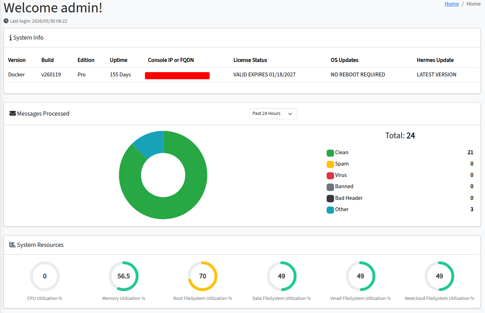
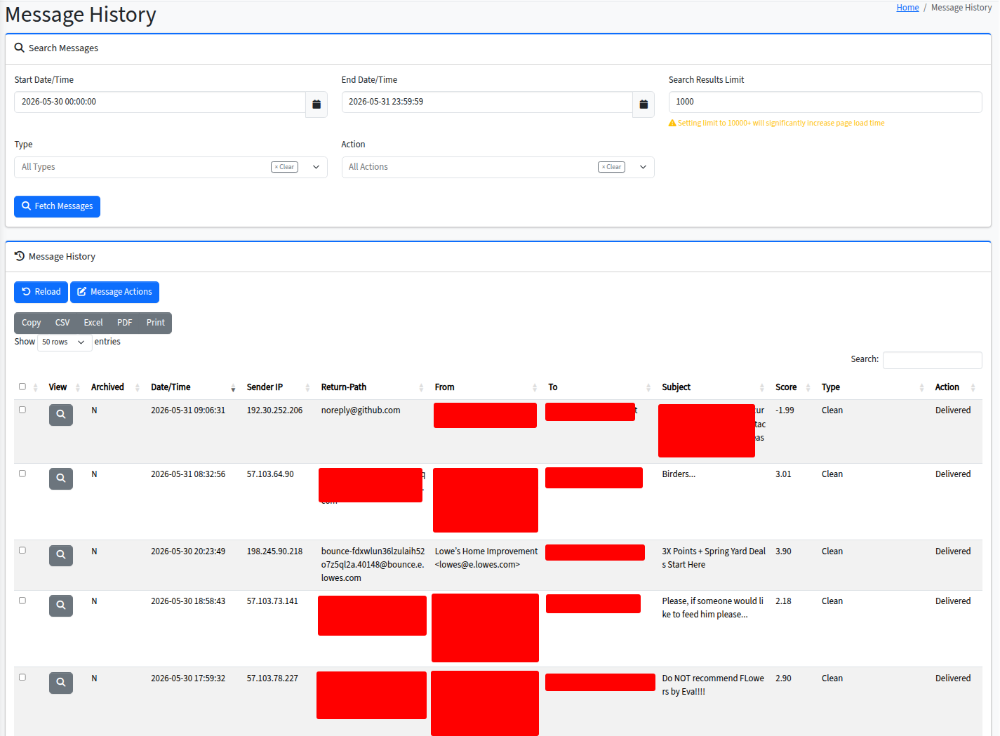
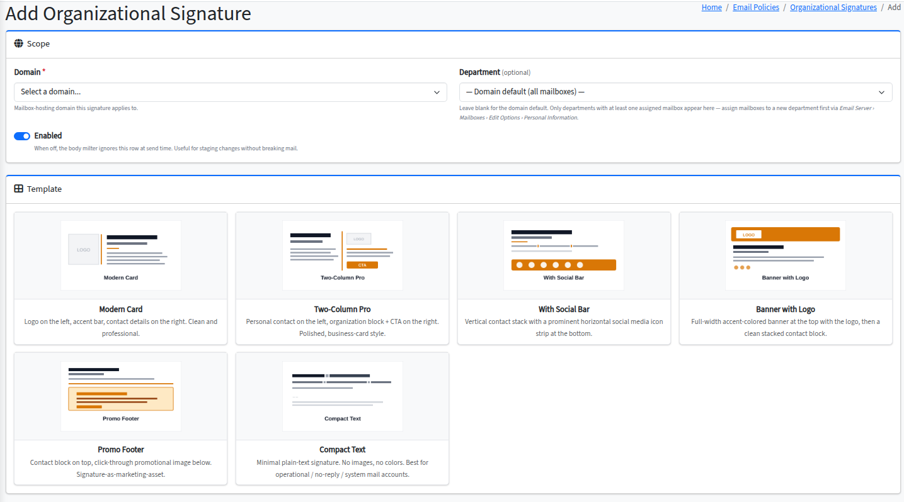

<p align="center">
  <a href="https://www.hermesseg.io">
    
  </a>
</p>

<h1 align="center">Hermes Secure Email Gateway and Email Server</h1>

<p align="center">
  <strong>Self-hosted email security, mail server, and Nextcloud — one stack, one Docker Compose file.</strong><br>
  Open-source spam &amp; malware filtering, S/MIME &amp; PGP encryption, DKIM/DMARC/ARC, mailboxes, webmail, and SSO.<br>
  Pro adds time-of-click link protection — the inbound-link defense you'd otherwise pay Proofpoint or Mimecast for.
</p>

<p align="center">
  <a href="https://www.hermesseg.io/features/">Features</a> &middot;
  <a href="https://www.hermesseg.io/pro/">Pro</a> &middot;
  <a href="https://www.hermesseg.io/pricing/">Pricing</a> &middot;
  <a href="https://docs.deeztek.com/shelves/hermes-seg-docker">Docs</a> &middot;
  <a href="https://www.hermesseg.io/support/">Support</a>
</p>

<p align="center">
  <a href="https://github.com/deeztek/Hermes-Secure-Email-Gateway/releases"></a>
  <a href="https://github.com/deeztek/Hermes-Secure-Email-Gateway/stargazers"></a>
  <a href="https://www.gnu.org/licenses/agpl-3.0.html"></a>
  <a href="https://github.com/deeztek/Hermes-Secure-Email-Gateway/issues"></a>
  <a href="https://matrix.to/#/#hermesseg:matrix.org"></a>
  <a href="https://t.me/HermesSEG"></a>
</p>

<p align="center">
  <em>
    Deployable as a gateway in front of Microsoft 365 / Google Workspace / Exchange,
    as a full mail server with built-in mailboxes, or in hybrid mode.
  </em>
</p>

<!--
  Screenshots row. Add these PNGs under docs/images/screenshots/ in the repo,
  or replace the src URLs with absolute hermesseg.io / imgur URLs if you prefer
  to keep binaries out of git history.
-->
<p align="center">
  
  &nbsp;
  
  &nbsp;
  
</p>

---

## Table of contents

- [About](#about)
- [Editions](#editions)
- [Features](#features)
- [Architecture](#architecture)
- [Storage topology](#storage-topology)
- [Requirements](#requirements)
- [Installation](#installation)
- [Updating](#updating)
- [Configuration](#configuration)
- [Recovery and maintenance tools](#recovery-and-maintenance-tools)
- [Documentation](#documentation)
- [Support](#support)
- [License](#license)

---

## About

Hermes Secure Email Gateway is a Free Open Source Secure Email Gateway **and** Email Server.

It provides spam, virus, and malware protection through Apache SpamAssassin, ClamAV, and Amavisd-new; full in-transit and at-rest email encryption via SMTP TLS, S/MIME, PGP, encrypted PDF (powered by CipherMail), and Dovecot mail-crypt; email archiving; integrated mailbox hosting on Dovecot with per-user quotas, aliases, shared folders, Sieve rules, vacation auto-reply, and mobile-device autoconfiguration; file sync, webmail, calendars (CalDAV), and contacts (CardDAV) through Nextcloud; a local user directory and single sign-on via OpenLDAP and Authelia &mdash; with multi-factor authentication via TOTP, WebAuthn, and Duo Push; and modern email authentication standards including SPF, DKIM signing and verification, DMARC, and ARC through OpenDKIM, OpenDMARC, and OpenARC.

Hermes combines these Open Source technologies under one unified web-based administration console for easy management of your organization's inbound and outbound email, mailbox users, encryption keys, and authentication policies. End users get a self-service portal for managing their own signatures, sieve rules, vacation messages, app passwords, and mobile-device profiles.

Hermes can be deployed three ways:

- **As a gateway** in front of an existing mail solution (in-house Exchange / Postfix, Google Workspace, Microsoft 365). Hermes scans, filters, encrypts, and relays mail to your backend.
- **As a full mail server** with built-in mailbox hosting, webmail, file sync, calendars, and contacts. No external mail backend required.
- **As a hybrid** &mdash; gateway for some domains AND mail server for others on the same install. Relay (gateway) domains and mailbox (mail server) domains coexist in a single Hermes deployment.

This Docker Edition packages the entire stack as a set of containers managed by Docker Compose, replacing the legacy bare-metal Ubuntu installer with a portable, reproducible deployment.

> **Looking for a managed version?** Hermes is self-hosted by design. If you want to support development and get vendor support, see [Pro pricing](https://www.hermesseg.io/pricing/) &mdash; per-server licensing, no per-mailbox fees.

## Editions

Hermes ships in two editions:

| Edition | License | What you get |
|---|---|---|
| **Community** | [AGPL v3](https://www.gnu.org/licenses/agpl.html) &mdash; free, open source | The entire mail gateway and email server stack. All core security, encryption, mailbox hosting, and administration features. |
| **Pro** | Commercial &mdash; see [EULA](https://docs.deeztek.com/books/hermes-seg-general-documentation/page/hermes-secure-email-gateway-pro-end-user-license-agreement-eula) | Everything in Community plus 6 advanced features (see [Pro Features](#pro-features) below). [Pricing &rarr;](https://www.hermesseg.io/pricing/) |

A Pro license is purchased separately. Community Edition needs no license file and works fully without one.

The project is licensed under **AGPLv3** ([`LICENSE`](LICENSE)); a small set of proprietary **Pro Edition** files are excluded from the AGPL grant and governed by the Pro EULA. See [`LICENSING.md`](LICENSING.md) for the authoritative breakdown — the per-file header controls which license applies.

## Features

A condensed list. See [hermesseg.io/features](https://www.hermesseg.io/features/) for the full feature page with screenshots.

### Mail security (Community)

- Spam protection (Apache SpamAssassin, postscreen, RBL configuration, sender/recipient/network block-allow lists, global sender filters)
- Anti-virus protection (ClamAV via Amavisd-new, with built-in feeds: ClamAV official + URLhaus)
- Malware feeds management (managed via Fangfrisch) &mdash; configure additional 3rd-party signature feeds including SaneSecurity, MalwarePatrol, SecuriteInfo, TwinWave, ClamPunch, RFXN, InterServer, Ditekshen, and more
- Per-recipient spam/virus/file policies
- Custom message rules, score overrides, custom file expressions/extensions/rules
- Quarantine, message-history search, queue management, train as spam/ham, release to recipient, download messages

### Encryption and authentication (Community)

- In-transit email encryption: SMTP TLS, S/MIME, PGP (via CipherMail)
- At-rest encryption: Dovecot mail crypt
- Encrypted PDF email for recipients without S/MIME or PGP
- Multi-factor authentication (Authelia): TOTP, WebAuthn, Duo Push
- Local LDAP user store (built-in OpenLDAP) for admins, mailbox users, and relay users
- App passwords for SMTP / IMAP / DAV clients (separate from main account password)
- Free Let's Encrypt (ACME) TLS certificates &mdash; automated issuance and auto-renewal for the admin console and per mailbox domain (SAN), plus import/CSR support for 3rd-party certificates
- haveibeenpwned password check integration

### Email standards (Community)

- SPF check, DKIM check + sign, DMARC verification (OpenDMARC)
- ARC (Authenticated Received Chain) signing and verification (OpenARC) &mdash; preserves authentication results across trusted forwarders
- DKIM key generation and management (UI)
- Multi-instance OpenDKIM for differential outbound-sign vs inbound-verify behavior
- DMARC report aggregation and reporting

### Email server / mailbox hosting (Community)

- Local mailbox hosting (Dovecot 2.4) with IMAPS / POP3S / Submission (587/465) / LMTP
- Per-domain and per-mailbox quotas
- Mailbox aliases and forwarders
- Shared mailboxes and shared folders
- User-defined Sieve rules
- Vacation auto-reply with date scoping and per-address filtering
- Mobile device autoconfiguration via signed `.mobileconfig` profiles (iOS) and CalDAV/CardDAV autodiscovery
- Personal email signatures (rich HTML, with template gallery)
- External Sender Banner (inbound mail from outside the org gets a visual banner)

### Nextcloud integration (Community)

- File sync (Nextcloud Files)
- Webmail (Nextcloud Mail)
- Calendars (CalDAV) and contacts (CardDAV)
- Single sign-on via Authelia OIDC
- Pre-provisioning of Nextcloud user accounts on first login

### Admin and user experience (Community)

- Modern AdminLTE 4 / Bootstrap 5 administrator console
- User self-service portal (per-mailbox)
- Real-time dashboard with system-resource monitoring
- Message statistics with visual charts
- Scheduled tasks UI (DB-backed Ofelia job management)
- Searchable system event logs
- Internal CA management (S/MIME)
- DNS resolver (Unbound, local-recursive)
- Console host and domain management

### Pro features

Pro Edition adds the following capabilities on top of everything in Community. [Full Pro feature page &rarr;](https://www.hermesseg.io/pro/)

| Pro Feature | What it does |
|---|---|
| **Email disclaimers** | Per-domain outbound disclaimer templates, applied at the milter level. Form-based template renderer with reusable templates. |
| **Organizational signatures** | Centrally-managed per-domain employee signature templates with placeholder substitution (employee name, title, phone, email, department, organization info). Renders on every outbound message. Community Edition has Personal Signatures (per-user, free-form) only. |
| **Intrusion Prevention (IPS)** | Web UI for managing Fail2ban jails, ban thresholds, ban duration, whitelists. Real-time view of active bans. |
| **Console firewall** | Web UI for managing the host firewall protecting the admin console (port allowlisting, source-IP restriction). |
| **LDAP RemoteAuth** | Per-domain pass-through authentication to one or more external LDAP servers (including Microsoft Active Directory). End users authenticate against your existing directory; Hermes provisions mailboxes on first successful login. Supports STARTTLS and LDAPS. |
| **Link Guard** | Time-of-click URL protection for inbound mail — comparable to Microsoft Safe Links and Proofpoint URL Defense. Links are rewritten to a Hermes redirect and the destination's reputation is checked at the moment the user clicks &mdash; catching links weaponized after delivery. Layered verdicts (heuristics + URLhaus / OpenPhish blocklist feeds + optional Google Safe Browsing / VirusTotal), open-redirect detection, an operator-managed list of abused cloud-storage / redirector hosts, and optional guarded redirect-chain following. Admin-configurable per-tier actions and outbound link restoration. Runs in-stack or on a separate host. |

## Architecture

Hermes SEG Docker Edition runs as **19 containers** orchestrated by Docker Compose:

| Container | Purpose |
|---|---|
| `hermes_unbound` | Recursive DNS resolver for the stack |
| `hermes_db_server` | MariaDB &mdash; Hermes, Authelia, Nextcloud, OpenDMARC, CipherMail, Syslog databases |
| `hermes_ofelia` | Scheduled task runner (cron replacement) |
| `hermes_nginx` | Reverse proxy + SSL termination (admin console, user portal, Nextcloud, CipherMail UI) |
| `hermes_authelia` | SSO portal with MFA (TOTP / WebAuthn / Duo Push) |
| `hermes_authelia_redis` | Session store for Authelia |
| `hermes_commandbox` | CFML application server (Lucee) &mdash; hosts admin console + user portal |
| `hermes_postfix_dkim` | Postfix MTA + OpenDKIM signer / verifier |
| `hermes_dmarc` | OpenDMARC verifier + report aggregator |
| `hermes_openarc` | OpenARC chain signer / verifier |
| `hermes_mail_filter` | Amavisd-new + SpamAssassin + ClamAV content filter |
| `hermes_body_milter` | Body-modification milter &mdash; signatures, disclaimers, external-sender banners, and Link Guard link rewriting / restore |
| `hermes_linkguard` | Link Guard time-of-click safe-links endpoint (URL rewriting + click-time reputation) |
| `hermes_ciphermail` | S/MIME, PGP, encrypted-PDF encryption gateway |
| `hermes_fail2ban` | Brute-force prevention (Dovecot, Authelia jails) |
| `hermes_dovecot` | IMAP / POP3 / Submission / LMTP / Sieve server |
| `hermes_ldap` | OpenLDAP &mdash; local user directory (admins, mailboxes, relay users) |
| `hermes_nextcloud` | File sync, webmail, CalDAV, CardDAV |
| `hermes_nextcloud_redis` | Cache + locking backend for Nextcloud |

## Storage topology

Hermes splits storage across **five independent tiers** so each can live on the right type of disk for its workload:

| Tier | Default path | Contents | Storage profile |
|---|---|---|---|
| **Config** | install root (implicit) | Repo working tree, generated config, secrets, `.env` | Fast SSD; sized by repo location |
| **Data** | `/mnt/data` | Databases, service logs, mail-filter state, Postfix queue | Fast SSD; sized for DB growth and log retention. **High write rate, backup-critical.** |
| **Archive** | `/mnt/archive` | Amavis quarantine archive | Cheap bulk; sized for retention policy &times; quarantine inflow. Grows unboundedly, cold access. |
| **Vmail** | `/mnt/vmail` | Dovecot mailboxes | Cheap bulk; sized for users &times; quota |
| **Nextcloud** | `/mnt/files` | Nextcloud app + user files + Redis cache | Cheap bulk; sized for user file storage |

Smaller deployments can collapse tiers &mdash; point Archive, Vmail, and Nextcloud at the same path as Data for a single-disk install. The installer prompts for each path; all four operator-selected mount points are mandatory (empty values risk relative path resolution during compose substitution).

See the canonical reference at [docs.deeztek.com &middot; Storage Topology (5 tiers)](https://docs.deeztek.com/books/installation-reference/page/storage-topology-5-tiers) or [`docs/install/storage-topology.md`](docs/install/storage-topology.md) in the repo.

## Requirements

| Item | Recommendation |
|---|---|
| Host OS | Any Linux distribution capable of running Docker Engine 24.0+ and Compose v2. **Tested reference: Ubuntu 24.04 Server.** |
| Docker | Engine 24.0+ |
| Docker Compose | v2 |
| CPU | 4 vCPUs minimum, more for higher mail volume |
| RAM | 8 GB minimum, 16 GB+ recommended for production |
| Disk | **Config / OS disk: 120 GB minimum** &mdash; OS, Docker engine, the full Hermes image set + running containers, the repo, and install/service logs. The four data tiers (**Data**, **Archive**, **Vmail**, **Nextcloud**) are sized to your anticipated usage &mdash; see [Storage topology](#storage-topology). For a small single-disk test install where all tiers collapse onto one disk, ~275 GB total (thin-provisioned) is a comfortable starting point. |
| Network | Static IP or DHCP reservation. See [docs](https://www.hermesseg.io/download/) for the full inbound + outbound port list (anti-spam services need TCP/2703, UDP/6277, TCP/24441, etc.) |

### Optional but recommended

For a production install, give **each storage tier its own physical or virtual disk** &mdash; separate from the OS disk and from each other. The tiers have deliberately different I/O and growth profiles, so isolating them lets you match disk to workload and size/expand each independently:

| Tier | Disk it wants | Why a dedicated disk |
| --- | --- | --- |
| **Data** | Fast SSD | High write rate (databases, logs, Postfix queue) and backup-critical &mdash; isolating it from the OS disk is the single biggest performance win |
| **Archive** | Commodity bulk | Quarantine archive grows unboundedly with retention; keep that growth off the DB/OS disk |
| **Vmail** | Commodity bulk | Dovecot mailboxes scale with users &times; quota; size and grow independently |
| **Nextcloud** | Commodity bulk | User files + Redis cache; size for file-storage growth independently |

None of this is *strictly required* &mdash; small or test deployments can collapse the tiers onto one disk (point Archive, Vmail, and Nextcloud at the same path as Data; see [Storage topology](#storage-topology) above). But for any install carrying real mail volume, a dedicated disk per tier is the recommended layout: it keeps the latency-sensitive Data tier fast, and prevents unbounded quarantine / mailbox / file growth from ever filling the database disk.

If you don't want a secondary drive for a given tier, simply create the directory on your primary disk (e.g., `mkdir /mnt/data /mnt/archive /mnt/vmail /mnt/files`) and point the installer at it.

## Installation

### 1. Clone the repository

Clone the repository wherever you'd like Hermes installed:

```bash
sudo git clone https://github.com/deeztek/Hermes-Secure-Email-Gateway.git
cd Hermes-Secure-Email-Gateway
```

### 2. Run the installer

```bash
sudo ./scripts/install_hermes_docker.sh
```

The installer runs the full install in a single session and takes 10&ndash;30 minutes on a fresh host (mostly image downloads and fail2ban container build).

The installer will:

1. Display the Pro EULA and ask for acceptance (Community Edition users can accept; the EULA only takes effect if a Pro license is later activated).
2. Prompt for mail-server hostname (FQDN), console address, host IP, upstream DNS forwarders, and the four storage mount paths (Data, Archive, Vmail, Nextcloud).
3. Generate all secrets and per-service config files (LDAP secrets, DB passwords, Authelia session keys, OIDC keypair, self-signed bootstrap cert, etc.).
4. Render `docker-compose.override.yml` to bind the tier paths into the right containers.
5. Run `docker compose up -d --build` to pull images and start the stack.
6. Initialize all databases (Hermes, Authelia, Nextcloud, OpenDMARC, CipherMail, Syslog), populate the LDAP base structure, create the initial admin user, and pre-provision the Nextcloud admin.
7. Print an installation summary with the admin console URL and one-time admin credentials.

### 3. Access the consoles

After install completes:

- **Admin Console**: `https://<console-host>/admin/`
- **User Portal**: `https://<console-host>/users/`
- **Nextcloud**: `https://<console-host>/nc/`

The installer prints the initial admin username and password on completion. Change the password on first login.

## Updating

Hermes SEG ships a single-command update orchestrator that handles git pull, image refresh, schema migrations, service restarts, and post-upgrade hooks in one go.

### Update to the latest release

```bash
cd /opt/hermes-seg-docker-gl
sudo ./scripts/system_update_docker.sh
```

This polls GitHub for the latest release, fetches the new tag, pulls updated images, applies any per-release schema/CFML/script artifacts, restarts services that need to be restarted, and runs the post-upgrade hook.

### Update to a specific release

```bash
sudo ./scripts/system_update_docker.sh v260601
```

### Preview without applying changes

```bash
sudo ./scripts/system_update_docker.sh --dry-run
```

### Other flags

| Flag | Purpose |
|---|---|
| `--skip-git` | Don't pull new code (containers + artifacts only) |
| `--skip-compose` | Don't touch docker images (git + artifacts only) |
| `--yes` | Skip the interactive confirmation prompt |
| `--help` | Show full usage |

For the full release-and-update methodology &mdash; including how artifacts are organized, idempotency rules, and the orchestrator's five-phase pipeline &mdash; see [`docs/install/release-and-update-methodology.md`](docs/install/release-and-update-methodology.md).

## Configuration

After the installer completes, the admin will be guided through first-run configuration tasks in the admin console:

1. **Confirm console host** &mdash; the install captures this at prompt time; admins can change it later under System &gt; Console Settings.
2. **Configure DNS records** &mdash; install summary prints the recommended SPF, DKIM, DMARC, and MX records to add. Use a real DNS-resolvable hostname before requesting any production Let's Encrypt certificate.
3. **Add domains** &mdash; under Email Server &gt; Domains (mailbox hosting) or Email Relay &gt; Domains (gateway / relay mode).
4. **Create mailboxes or relay recipients** &mdash; under Email Server &gt; Mailboxes or Email Relay &gt; Recipients.
5. **Set up SSL** &mdash; either upload a 3rd-party certificate (System &gt; System Certificates) or request a free Let's Encrypt certificate via the same page.

Detailed configuration walkthroughs &mdash; including SPF/DKIM/DMARC setup, mailbox provisioning, relay vs. mail-server modes, and the encryption gateway &mdash; live in the [Documentation](#documentation) section.

## Recovery and maintenance tools

The install script also provides a set of recovery and maintenance flags:

| Command | Purpose |
|---|---|
| `sudo ./scripts/install_hermes_docker.sh --show-config` | Display current storage paths and configuration |
| `sudo ./scripts/install_hermes_docker.sh --show-summary` | Reprint the post-install summary (admin URL, credentials reminder) |
| `sudo ./scripts/install_hermes_docker.sh --apply-schema` | Lower-level schema-only update (the canonical update path is `system_update_docker.sh`) |
| `sudo ./scripts/install_hermes_docker.sh --init-db` | Re-run phase 2 (post-container) initialization only &mdash; recovery flag for partial installs |
| `sudo ./scripts/install_hermes_docker.sh --generate-secrets` | Regenerate per-service secrets and re-render derived configs |
| `sudo ./scripts/install_hermes_docker.sh --configure-storage` | Re-prompt for storage mount paths and regenerate the override file |
| `sudo ./scripts/install_hermes_docker.sh --wipe` | **Destructive.** Tear down everything (containers, volumes, credentials, install state) for a fresh start. Requires double confirmation. |

Run any of the above with `--help` for full usage. The installer is **idempotent**: re-running it (or any of its sub-steps) on an already-installed system skips already-completed work via state guards.

## Documentation

### In-repo documentation

- [`docs/install/release-and-update-methodology.md`](docs/install/release-and-update-methodology.md) &mdash; canonical reference for how Hermes is released, distributed, and upgraded
- [`docs/install/storage-topology.md`](docs/install/storage-topology.md) &mdash; the five-tier storage model (Config / Data / Archive / Vmail / Nextcloud)

### Per-release change log

Each release's change log lives on its [GitHub Release page](https://github.com/deeztek/Hermes-Secure-Email-Gateway/releases) &mdash; one body per tag, scoped to that release only.

### Online documentation

Operator and end-user documentation is published at **[docs.deeztek.com/shelves/hermes-seg-docker](https://docs.deeztek.com/shelves/hermes-seg-docker)**, organized into:

- [Installation & Reference](https://docs.deeztek.com/books/installation-reference) &mdash; Get Started, Release & Update Methodology, Storage Topology, Email Flow
- [Administrator Guide](https://docs.deeztek.com/books/administrator-guide) &mdash; full reference for system administrators (60 pages across 7 chapters)
- [User Guide](https://docs.deeztek.com/books/user-guide) &mdash; end-user portal documentation (11 pages)

## Support

| Channel | Use it for |
|---|---|
| [GitHub Discussions](https://github.com/deeztek/Hermes-Secure-Email-Gateway/discussions) | Long-form Q&A, "how do I…", configuration help. Searchable. |
| [Matrix `#hermesseg:matrix.org`](https://matrix.to/#/#hermesseg:matrix.org) | Real-time community chat. |
| [Telegram `HermesSEG`](https://t.me/HermesSEG) | Same audience as Matrix, different client. |
| [GitHub Issues](https://github.com/deeztek/Hermes-Secure-Email-Gateway/issues) | Bugs and feature requests. |
| [helpdesk.deeztek.com](https://helpdesk.deeztek.com) | Paid support tickets (Pro license holders). |
| [hermesseg.io/support](https://www.hermesseg.io/support/) | All support options in one place + [Support Terms & Conditions](https://www.hermesseg.io/support-terms-conditions/). |

**Stay updated**: subscribe to release notes and security advisories at [hermesseg.io](https://www.hermesseg.io/) (newsletter signup in the footer).

## License

Hermes Secure Email Gateway **Community Edition** is free software licensed under the [GNU Affero General Public License v3.0](https://www.gnu.org/licenses/agpl.html).

Hermes Secure Email Gateway **Pro Edition** is **not** free software. It is covered by the [Hermes Secure Email Gateway Pro End-User License Agreement](https://docs.deeztek.com/books/hermes-seg-general-documentation/page/hermes-secure-email-gateway-pro-end-user-license-agreement-eula).

Copyright Dionyssios Edwards 2011&ndash;2026. All Rights Reserved.
